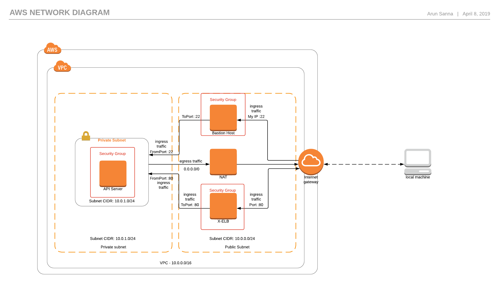

# Project : Simple-API-Server

# Description
This is a small application deployment, which will respond to POST API calls, In this use-case, we send a JSON payload contains multiple JSON Object contain info related to builds, which are created at mulitple time intervals.

goal is to get the latest build details AMI-ID, Date and Hash from the provided json payload.

Application is written in Python, used flask library. This application is now serving only the POST requests and application runs on port 80.

All application logs, POST requests and responses are logged to location `/var/log/api-server.log`

# Architecture Diagram

# Prerequesites
  1. Install git
  2. Insall awscli
  3. Configure your credentials to profile by `aws configure --profile PROFILE-NAME`
  4. Install terraform

# Deployment guidelines

* Clone the project
  * This is a public repo, dont worry no credentials are hardcoded.
  * `git clone git@github.com:arunsanna/simple-api-server.git` 

* Deploy the infrastructure
  * Change your directory to root level of project `cd simple-api-server`
  * Run the command `bash scripts\deploy.sh`
  * This script will get your public IP address and SSH is allowed only from your IP address and ELB is also allowed only from your IP address.
  * This script will ask for your public key, So we can import the same key into AWS account and login into EC2 Intance if needed.
  * If you dont have one yet, create it by `ssh-keygen`
  * Once you run the script it will show the deployment of the infrastructure, at the end it will output the ELB address to access and Bastion IP to connect to bastion. SSH-key and Profile are recorded to use them during destroy process.

* Test the API
  * To test the API, you need to wait until XELB passes the health check, if not it wont allow traffic to the server.
  * Once ELB health check is passed you can run this script by command `bash scripts/test.sh`
  * This will return as json with AMI-ID, Date and hash related to latest build.

* Destroy the infrastructure
  * Once you are done with testing make sure you destroy the infra
  * To destroy the infra you can run `bash scripts/destroy.sh`

Note : you need to all of these scripts from the root directory only. make sure you configured profile correctly.

